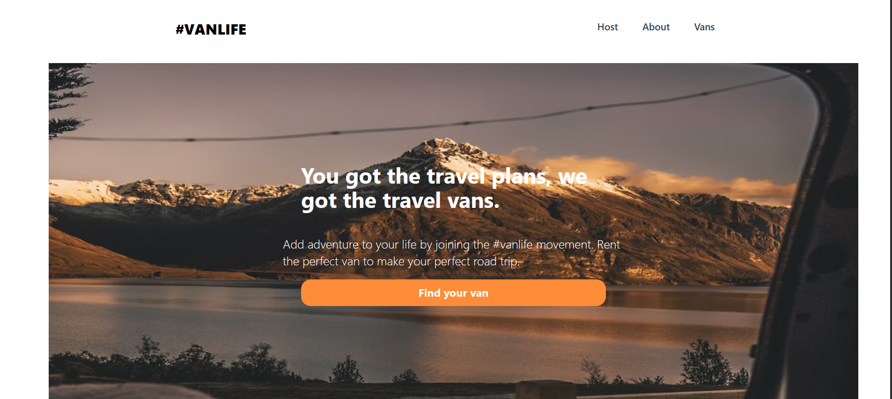

# Van Life

Welcome to the **Van Life** project! 🚐✨

## Overview

This project is a React TypeScript application I built while learning **React Router**. The goal of this application is to simulate a van rental platform where users can browse different travel vans, view details, and manage their own listed vans in a host dashboard.

Throughout this project, I gained hands-on experience with modern React routing features, specifically focusing on:

- **Nested Routes:** Creating complex layouts with persistent UI elements (like the Host Dashboard) while navigating through sub-sections (Income, Reviews, specific Van management).
- **Loaders (`useLoaderData`):** Pre-fetching data before routing to pages to handle asynchronous requests seamlessly and ensure components have what they need immediately on render.

## Features

- **Home Page:** A welcoming landing page to start your van life movement.
- **Vans Explorer:** Filter and browse available rental vans.
- **Van Details:** View pricing, category, descriptions, and high-quality imagery of the van.
- **Host Dashboard:** A dedicated space for hosts to view their income, reviews, and a detailed list of their currently managed vans (using deeply nested routing).
- **Responsive Design:** Using Tailwind CSS to create fluid, mobile-friendly layouts.